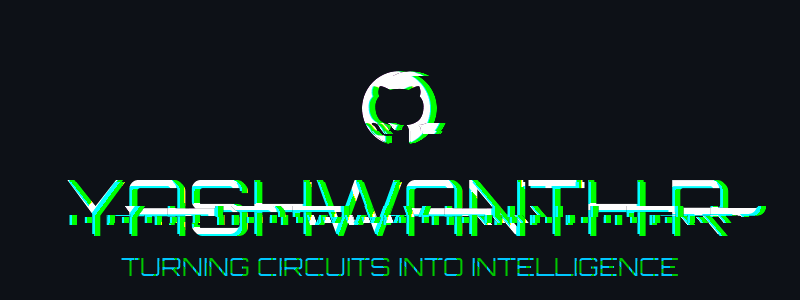

<div align="center">



<br><br>

<picture>
  <source media="(prefers-color-scheme: dark)" srcset="https://readme-typing-svg.demolab.com?font=Fira+Code&size=20&duration=3000&pause=1000&color=FF6600&center=true&vCenter=true&width=650&lines=Electrical+and+Electronics+Engineer;Student+at+VVCE+Mysore;IoT+%7C+Embedded+Systems+%7C+Automation;Turning+Circuits+into+Intelligence" />
  <source media="(prefers-color-scheme: light)" srcset="https://readme-typing-svg.demolab.com?font=Fira+Code&size=20&duration=3000&pause=1000&color=0047AB&center=true&vCenter=true&width=650&lines=Electrical+and+Electronics+Engineer;Student+at+VVCE+Mysore;IoT+%7C+Embedded+Systems+%7C+Automation;Turning+Circuits+into+Intelligence" />
  
</picture>

<br><br>

<a href="https://www.linkedin.com/in/yashwanth-r-7855a7395">

</a>


</div>

---

## SYSTEM IDENTITY
```
NAME        : Yashwanth R
ROLE        : EEE Engineer | IoT Developer | Hardware Builder | Student
LOCATION    : Mysore, Karnataka, India
INSTITUTION : Vidyavardhaka College of Engineering, Mysore
STATUS      : [ ONLINE ] — Building the future, one circuit at a time
INTERESTS   : IoT · Embedded Systems · Power Electronics · Automation
MISSION     : Merging hardware and firmware to solve real-world problems, ROBOTICS
```

---

## ABOUT ME

> *"TURNING IDEAS INTO ENERGY"*

I am a **B.E. Electrical and Electronics Engineering** student at **VVCE Mysore** who lives at the intersection of hardware design, embedded firmware, and IoT automation.

I do not just study how circuits work — I build systems that **sense, think, and respond** to the real world. From smart warehouse automation to IoT-based home control systems, I turn ideas into working hardware.

My mission is simple — bridge the gap between hardware and software through disciplined engineering, clean code, and creative problem solving.

- Currently building **IoT automation and smart energy systems**
- Hands-on with **ESP8266, Arduino, NodeMCU, and sensor integration**
- Exploring **power systems, PLC programming, and smart grid technologies**
- Open to **internships, collaborations, and real-world project challenges**

---


<div align="center">
  
</div>

<div align="center">

<picture>
  <source media="(prefers-color-scheme: dark)" srcset="https://streak-stats.demolab.com?user=yashwanthR1207&theme=dark&hide_border=false&border=FF6600&background=0D0D0D&stroke=00FFFF&ring=FF6600&fire=FF6600&currStreakNum=00FFFF&sideNums=ffffff&currStreakLabel=FF6600&sideLabels=00FFFF&dates=888888&date_format=j+M%5B+Y%5D&mode=weekly&card_width=800" />
  <source media="(prefers-color-scheme: light)" srcset="https://streak-stats.demolab.com?user=yashwanthR1207&theme=default&hide_border=false&border=0047AB&background=F0F4FF&stroke=0047AB&ring=FF6600&fire=FF6600&currStreakNum=0047AB&sideNums=1a1a1a&currStreakLabel=FF6600&sideLabels=0047AB&dates=555555&date_format=j+M%5B+Y%5D&mode=weekly&card_width=800" />
  
</picture>

</div>

---

<div align="center">
  
</div>

<div align="center">

<picture>
  <source media="(prefers-color-scheme: dark)" srcset="https://github-readme-activity-graph.vercel.app/graph?username=yashwanthR1207&theme=react-dark&v=1" />
  <source media="(prefers-color-scheme: light)" srcset="https://github-readme-activity-graph.vercel.app/graph?username=yashwanthR1207&theme=react&v=1" />
  
</picture>

</div>

---

<div align="center">
  
</div>

<div align="center">

<picture>
  <source media="(prefers-color-scheme: dark)" srcset="https://raw.githubusercontent.com/yashwanthR1207/yashwanthR1207/output/github-contribution-grid-snake-dark.svg?v=2" />
  <source media="(prefers-color-scheme: light)" srcset="https://raw.githubusercontent.com/yashwanthR1207/yashwanthR1207/output/github-contribution-grid-snake.svg?v=2" />
  
</picture>

</div>

---

<div align="center">
  
</div>

<div align="center">


<br>


<br><br>


<br>


<br><br>


<br>


<br><br>


<br>


</div>

---

<div align="center">
  
</div>

<!-- PROJECTS:START -->
<table>
  <tr>
    <th>Project</th>
    <th>Tech Stack</th>
  </tr>
  <tr>
    <td><b><a href="https://github.com/yashwanthR1207/yashprofile.2">Yashprofile.2</a></b></td>
    <td> <sub>91.6%</sub>&nbsp;&nbsp; <sub>7.9%</sub></td>
  </tr>
  <tr>
    <td><b><a href="https://github.com/yashwanthR1207/IOTautomations">Iotautomations</a></b></td>
    <td> <sub>83.1%</sub>&nbsp;&nbsp; <sub>13.6%</sub>&nbsp;&nbsp; <sub>3.4%</sub></td>
  </tr>
  <tr>
    <td><b><a href="https://github.com/yashwanthR1207/cv-flower">Cv Flower</a></b></td>
    <td> <sub>67.2%</sub>&nbsp;&nbsp; <sub>21.1%</sub>&nbsp;&nbsp; <sub>11.7%</sub></td>
  </tr>
  <tr>
    <td><b><a href="https://github.com/yashwanthR1207/main-portfolio">Main Portfolio</a></b></td>
    <td> <sub>52.1%</sub>&nbsp;&nbsp; <sub>26.5%</sub>&nbsp;&nbsp; <sub>21.4%</sub></td>
  </tr>
  <tr>
    <td><b><a href="https://github.com/yashwanthR1207/BLUTHOOTHfiletransfer-viva-Cprogram">Bluthoothfiletransfer Viva Cprogram</a></b></td>
    <td> <sub>100.0%</sub></td>
  </tr>
  <tr>
    <td><b><a href="https://github.com/yashwanthR1207/AIOT-plant-detection-">Aiot Plant Detection </a></b></td>
    <td> <sub>47.0%</sub>&nbsp;&nbsp; <sub>27.3%</sub>&nbsp;&nbsp; <sub>19.4%</sub>&nbsp;&nbsp; <sub>6.3%</sub></td>
  </tr>
  <tr>
    <td><b><a href="https://github.com/yashwanthR1207/LED-blink-ESP32-">Led Blink Esp32 </a></b></td>
    <td>N/A</td>
  </tr>
  <tr>
    <td><b><a href="https://github.com/yashwanthR1207/RoboSOCCER-VERSION1">Robosoccer Version1</a></b></td>
    <td> <sub>100.0%</sub></td>
  </tr>
  <tr>
    <td><b><a href="https://github.com/yashwanthR1207/led-blink-arduino">Led Blink Arduino</a></b></td>
    <td>N/A</td>
  </tr>
  <tr>
    <td><b><a href="https://github.com/yashwanthR1207/Robo-soccer-Version-2">Robo Soccer Version 2</a></b></td>
    <td> <sub>100.0%</sub></td>
  </tr>
  <tr>
    <td><b><a href="https://github.com/yashwanthR1207/ROBO-SUMO-version-1">Robo Sumo Version 1</a></b></td>
    <td> <sub>100.0%</sub></td>
  </tr>
  <tr>
    <td><b><a href="https://github.com/yashwanthR1207/RC-car-version1">Rc Car Version1</a></b></td>
    <td> <sub>100.0%</sub></td>
  </tr>
  <tr>
    <td><b><a href="https://github.com/yashwanthR1207/IoT-Based-Intelligent-Godown-Automation-and-Safety-System">Iot Based Intelligent Godown Automation And Safety System</a></b></td>
    <td> <sub>100.0%</sub></td>
  </tr>
  <tr>
    <td><b><a href="https://github.com/yashwanthR1207/Smart-Home-Automation-System-using-ESP8266">Smart Home Automation System Using Esp8266</a></b></td>
    <td> <sub>100.0%</sub></td>
  </tr>
</table>

<!-- PROJECTS:END -->
---

<div align="center">
  
</div>
```
Smart Energy Monitoring System    
IoT-Based Load Controller         
MATLAB Power System Simulation
Robotics
ROBO COMPETITIONS     
GitHub Portfolio Cleanup         
```

---

## OPEN TO


---

<div align="center">

*If you found my work useful — drop a star and let us build something great together.*

<br>

<picture>
  <source media="(prefers-color-scheme: dark)" srcset="https://capsule-render.vercel.app/api?type=waving&color=0:0d0d0d,50:161616,100:0d0d0d&height=120&section=footer" />
  <source media="(prefers-color-scheme: light)" srcset="https://capsule-render.vercel.app/api?type=waving&color=0:f0f4ff,50:e8f0fe,100:f0f4ff&height=120&section=footer" />
  
</picture>

</div>

